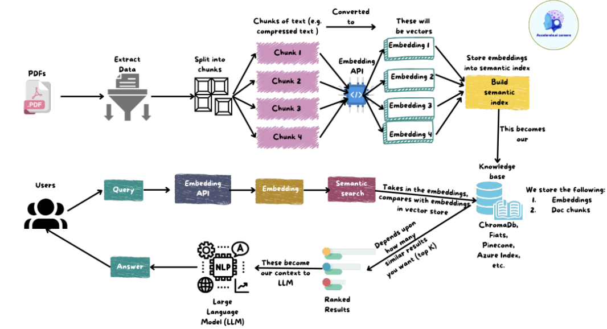
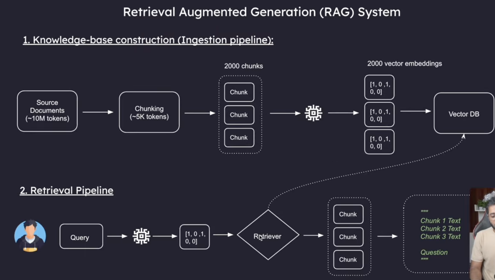

**Dependencies** :
- pip install langchain langchain-community langchain-openai langchain-text-splitters langchain-chroma chromadb python-dotenv openai tiktoken

**Files sequence**
1. ingestion_pipeline.py
2. retrival.py
- Develop both the pipeline now, answer generation for user (take the revelant chunks and user query and give it to LLM)

### Cosine Similarity
 
Cosine similarity is a measure of similarity between two vectors based on the **angle between them**, regardless of their magnitude.
 
#### Core Idea
 
Instead of measuring how far apart two vectors are (like Euclidean distance), cosine similarity measures the **angle** between them. Two vectors pointing in the same direction are similar, even if one is much longer than the other.
 
#### Formula
 
$$\cos(\theta) = \frac{A \cdot B}{\|A\| \times \|B\|}$$
 
Where:
 
- **A · B** = dot product of the two vectors
- **‖A‖, ‖B‖** = magnitudes (lengths) of the vectors
 
#### Output Range
 
| Value | Meaning |
|-------|---------|
| **1** | Identical direction (perfectly similar) |
| **0** | Perpendicular (no similarity) |
| **-1** | Opposite direction (completely dissimilar) |

Note: Modern embedding model (like openAI's text-embedding-3-small) - all vectors are naormalized (i.e magnitude are always 1)