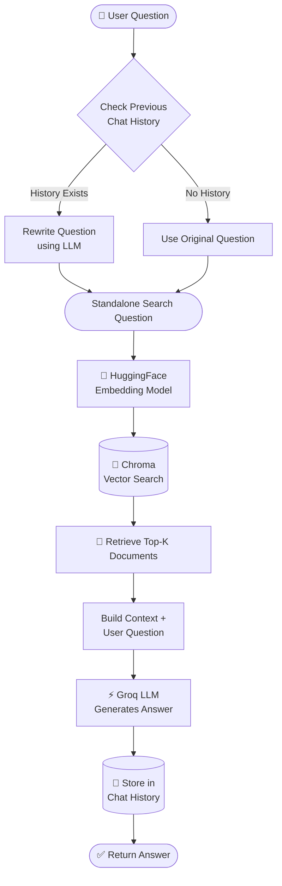

**Dependencies** :
- pip install langchain langchain-community langchain-openai langchain-text-splitters langchain-chroma chromadb python-dotenv openai tiktoken

- pip install langchain-groq (https://console.groq.com?utm_source=chatgpt.com) - for API key

**Files sequence**
1. ingestion_pipeline.py
2. retrival.py
- Develop both the pipeline now, answer generation for user (take the revelant chunks and user query and give it to LLM) in the same retrival.py file
- output after this two: 

3. 3_history_aware_generation.py

--- 

### Cosine Similarity
 
Cosine similarity is a measure of similarity between two vectors based on the **angle between them**, regardless of their magnitude.
 
#### Core Idea
 
Instead of measuring how far apart two vectors are (like Euclidean distance), cosine similarity measures the **angle** between them. Two vectors pointing in the same direction are similar, even if one is much longer than the other.
 
#### Formula
 
$$\cos(\theta) = \frac{A \cdot B}{\|A\| \times \|B\|}$$
 
Where:
 
- **A · B** = dot product of the two vectors
- **‖A‖, ‖B‖** = magnitudes (lengths) of the vectors
 
#### Output Range
 
| Value | Meaning |
|-------|---------|
| **1** | Identical direction (perfectly similar) |
| **0** | Perpendicular (no similarity) |
| **-1** | Opposite direction (completely dissimilar) |

Note: Modern embedding model (like openAI's text-embedding-3-small) - all vectors are naormalized (i.e magnitude are always 1)

--- 

- In basic RAG, each query is treated independently. The retriever takes your exact question and searches for chunks.
In history-aware RAG, there's one crucial extra step: query reformulation.

- Before searching, the system looks at the conversation history and rewrites vague or context-dependent questions into clear, standalone questions.

- Why This Matters: Follow-up Questions
Humans naturally ask follow-up questions using pronouns, referencessss, and assumptions based on previous conversation. These questions are often unsearchable on their own.

Reference from file 3_history_aware_generation.py

 
---

**Chunking is the critical second step - it determines how your content gets divided for retrieval.Your RAG system doesn't search entire documents. It searches chunks. So the final answer generation quality depends on those chunks.**

#### The Problem with Basic Chunking

In our first videos, we used `CharacterTextSplitter` — it simply cuts text at fixed character counts. Simple, but crude.

###### Example with Tesla Document

#### Chunk 1

> "Tesla's Q3 revenue was $25.2B, up from $21.3B in Q2. The increase was driven by record Model Y sales which reached 350,000 units. However, production costs rose by 12% due to supply chain..."

#### Chunk 2

> "...challenges and inflation. Elon Musk stated that the company expects to maintain growth through 2024 despite economic headwinds. The Cybertruck launch has been delayed again..."

#### Problems

1. **Splits mid-sentence**
   - `"supply chain..."` / `"...challenges"`

2. **Breaks related concepts apart**
   - Information that belongs together gets separated into different chunks.

3. **Context gets lost across chunks**
   - The retriever and LLM may miss important relationships between ideas.