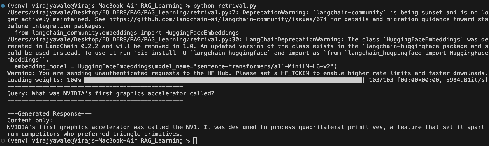

**Dependencies** :
- pip install langchain langchain-community langchain-openai langchain-text-splitters langchain-chroma chromadb python-dotenv openai tiktoken

- pip install langchain-groq (https://console.groq.com?utm_source=chatgpt.com) - for API key


**Files sequence**
1. ingestion_pipeline.py
2. retrival.py
- Develop both the pipeline now, answer generation for user (take the revelant chunks and user query and give it to LLM) in the same retrival.py file
- output after this two: 

3. 3_history_aware_generation.py

--- 

### Cosine Similarity
 
Cosine similarity is a measure of similarity between two vectors based on the **angle between them**, regardless of their magnitude.
 
#### Core Idea
 
Instead of measuring how far apart two vectors are (like Euclidean distance), cosine similarity measures the **angle** between them. Two vectors pointing in the same direction are similar, even if one is much longer than the other.
 
#### Formula
 
$$\cos(\theta) = \frac{A \cdot B}{\|A\| \times \|B\|}$$
 
Where:
 
- **A · B** = dot product of the two vectors
- **‖A‖, ‖B‖** = magnitudes (lengths) of the vectors
 
#### Output Range
 
| Value | Meaning |
|-------|---------|
| **1** | Identical direction (perfectly similar) |
| **0** | Perpendicular (no similarity) |
| **-1** | Opposite direction (completely dissimilar) |

Note: Modern embedding model (like openAI's text-embedding-3-small) - all vectors are naormalized (i.e magnitude are always 1)

--- 

- In basic RAG, each query is treated independently. The retriever takes your exact question and searches for chunks.
In history-aware RAG, there's one crucial extra step: query reformulation.

- Before searching, the system looks at the conversation history and rewrites vague or context-dependent questions into clear, standalone questions.

- Why This Matters: Follow-up Questions
Humans naturally ask follow-up questions using pronouns, referencessss, and assumptions based on previous conversation. These questions are often unsearchable on their own.

Reference from file 3_history_aware_generation.py


 
---

**Chunking is the critical second step - it determines how your content gets divided for retrieval.Your RAG system doesn't search entire documents. It searches chunks. So the final answer generation quality depends on those chunks.**

#### The Problem with Basic Chunking

we used `CharacterTextSplitter` — it simply cuts text at fixed character counts. Simple, but crude.

###### Example with Tesla Document

#### Chunk 1

> "Tesla's Q3 revenue was $25.2B, up from $21.3B in Q2. The increase was driven by record Model Y sales which reached 350,000 units. However, production costs rose by 12% due to supply chain..."

#### Chunk 2

> "...challenges and inflation. Elon Musk stated that the company expects to maintain growth through 2024 despite economic headwinds. The Cybertruck launch has been delayed again..."

#### Problems

1. **Splits mid-sentence**
   - `"supply chain..."` / `"...challenges"`

2. **Breaks related concepts apart**
   - Information that belongs together gets separated into different chunks.

3. **Context gets lost across chunks**
   - The retriever and LLM may miss important relationships between ideas.

### Why Better Chunking Matters

Your retrieval and the final answer generation are only as good as your chunks. **Bad chunks = bad answers.**

#### Common Chunking Problems

#### 1. Too Small
**Lacks context**

- Important details may be separated from their supporting information.
- The retriever may return incomplete information.

#### 2. Too Large
**Too much noise, hits embedding model/context window limits**

- Embeddings become less focused.
- More irrelevant information is included.
- Can exceed LLM context window constraints.

#### 3. Poor Boundaries
**Splits related information**

- Related concepts are divided across chunks.
- Important relationships between ideas may be lost.

#### 4. No Structure Awareness
**Ignores document format**

- Headings, sections, tables, and lists are not preserved.
- Document hierarchy and meaning can be lost during chunking.

### The 5 Chunking Strategies We'll Cover

#### 1. CharacterTextSplitter (Beyond Basic `chunk_size`)

- **Custom separators** (split on specific patterns)
- Still useful for simple, uniform documents or when speed matters most

#### 2. RecursiveCharacterTextSplitter (Upgrade from CharacterTextSplitter)

- Tries to split at natural boundaries (paragraphs, sentences, words)
- Falls back gracefully if chunks are too big
- Preserves more context than basic splitting

#### 3. Document-Specific Splitting (Respects Document Structure)

- **PDF:** Splits by pages, sections, and headers
- **Markdown:** Splits by headers, code blocks, and lists
- Each document type gets appropriate treatment

#### 4. Semantic Splitting (Content-Aware Boundaries)

- Uses embeddings to detect topic shifts
- Keeps related concepts together
- Splits when meaning changes, not just by size
- More intelligent but computationally expensive

#### 5. Agentic Splitting (AI-Powered Chunking)

- LLM analyzes content and decides optimal splits
- Can understand complex relationships
- Adapts to content type automatically
- Most sophisticated, but also the slowest and most expensive approach

--- 

# CharacterTextSplitter

CharacterTextSplitter doesn't simply split text based on a fixed number of characters. Instead, it uses a **split-first, merge-second** strategy to create meaningful chunks.

## Workflow

1. **Split**
   - Break the text using predefined separators.
   - Default separator: `\n\n` (double newline).

2. **Merge**
   - Gradually combine the split pieces.
   - Stop merging when the resulting chunk reaches the specified `chunk_size`.

## Benefits

- Preserves natural text boundaries.
- Produces more coherent chunks for embeddings and retrieval.
- Reduces the chances of splitting important context in the middle of a sentence or paragraph.

--- 


# SemanticChunker

## How it Works

Semantic chunking breaks long documents into meaningful pieces by identifying where topics naturally change.

Instead of splitting text based on fixed word counts or character limits, it uses AI embeddings to understand the semantic meaning of sentences.

If one sentence discusses a particular topic and the next sentence discusses a completely different topic, the chunker recognizes this shift and creates a new chunk boundary.


## 3-Step Process

### 1. Encode
Convert each sentence into embeddings (numerical vector representations).

### 2. Compare
Calculate similarity scores between neighboring sentences to measure how closely related they are.

### 3. Split
Create chunk boundaries whenever the similarity score drops significantly, indicating a topic change.

## Benefits

- Preserves semantic meaning and context.
- Keeps related information together.
- Produces more relevant chunks for Retrieval-Augmented Generation (RAG).
- Improves retrieval quality compared to fixed-size chunking methods.
- Reduces the chances of splitting important concepts across multiple chunks.


## Example

**Before Semantic Chunking**

```text
Machine Learning is used for prediction.
Neural Networks are a type of Machine Learning model.
The Eiffel Tower is located in Paris.
France is a popular tourist destination.